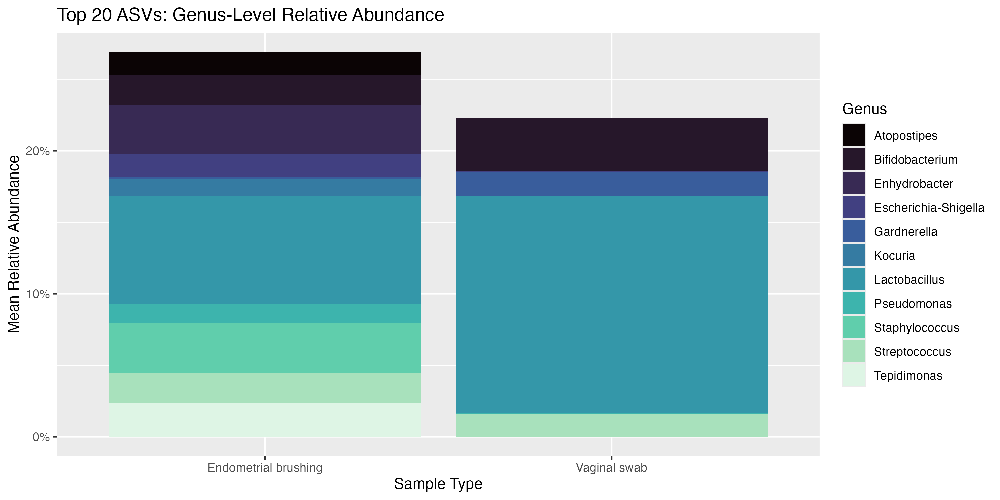
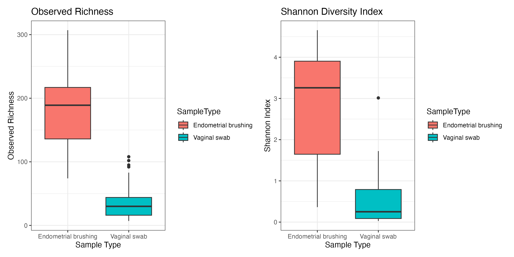
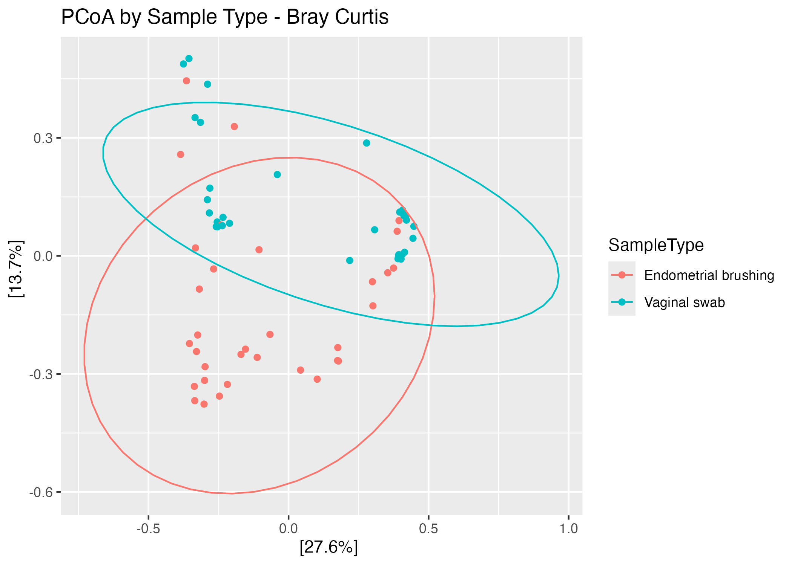

# Female Reproductive Tract Microbiome Analysis - 16S rRNA Workflow

## 🔬 Project Overview
This repository contains a reproducible workflow for analyzing publicly available 16S rRNA sequencing data to investigate differences in samples from the female reproductive tract (vaginal swab and endometrial brushing).

The project aims to characterize microbial composition and diversity, identify differentially abundant taxa, and their predicted functions.

## ❓ Research Question
How do microbial composition and diversity differ between two different female reproductive tract sites (Vaginal vs Endometrial brushing)?

## 🎯 Objectives 
 - Characterize differences in microbial composition and diversity between Vaginal vs Endometrial brushing samples
 - Identify differentially abundant ASVs
 - Explore differentially abundant MetaCyc Pathways
 - Generate reproducible visualizations and statistical analyses 


## 🧬 Dataset Information

 **Study accession:** PRJNA1247240
 
 **Data type:** Paired-end 16S rRNA amplicon sequencing (V4 region, 2 × 300 bp) 

 **Sequencing platform:** Illumina MiSeq
 
 **Population:** Females of reproductive age undergoing Assisted Reproductive Therapy (ART)

 **Source:** NCBI Sequence Read Archive (SRA)

 **Associated publication:** 
 Sola-Leyva, A., Pérez-Prieto, I., Canha-Gouveia, A., Salas-Espejo, E., Molina, N. M., Vargas, E., ... & Altmäe, S. (2026). Comprehensive 16S rRNA gene sequencing and meta-transcriptomic analyses of the female reproductive tract microbiota: two molecular profiles with different messages. Human Reproduction Open, 2026(1), hoag001.

---

## ⚙️ Workflow
  1. Download sequencing data
  2. Quality assessment using FastQC and MultiQC
  3. Read filtering and trimming
  4. ASV inference using DADA2
  5. Chimera removal
  6. Taxonomic assignment
  7. Diversity analysis
  8. Differential abundance analysis using ANCOM-BC2
  9. Functional Prediction using PICRUSt2 
  10.Differential MetaCyc Pathways analysis
  11. Data visualization

---

## 🗂️ Repository Structure 

```text
obgyn-16S-analysis/
├── .gitignore
├── 1-data/
│   ├── SRR_Acc_List.txt
│   ├── SraRunTable.csv
│   └── Supp-table-1.xlsx
├── 2-scripts/
│   ├── 1-Download-fastq.sh
│   ├── 2-QC-assessment.sh
│   ├── 3-ASV-DADA2-Workflow.R
│   ├── 4-ASV-Post-Processing.R
│   ├── 5-ASV-Differential-Abundance-ANCOMBC2.R
│   ├── 6-1-Convert-output-to-biom.R
│   ├── 6-2-PICRUSt2-Workflow.sh
│   └── 6-3-Functional-Analysis.R
├── 3-results/
│   ├── ASV-ANCOMBC2/
│   │   ├── ANCOMBC2_results.csv
│   │   └── significant_ASVs.csv
│   ├── DADA2/
│   │   ├── asv_table.csv
│   │   ├── figures/
│   │   │   └── top20_ASVs_Genus.png
│   │   └── taxonomy_table.csv
│   ├── Functional-Pred-Analysis/
│   │   ├── KO_PERMANOVA_results.csv
│   │   ├── MetaCyc_ANCOMBC2_results.csv
│   │   ├── MetaCyc_ANCOMBC2_sig.csv
│   │   ├── MetaCyc_PERMANOVA_results.csv
│   │   └── figures/
│   │       ├── PCoA_KOs.png
│   │       ├── PCoA_MetaCyc_Pathways.png
│   │       ├── Top20_MetaCyc_diff_abun_barplot.png
│   │       └── Top20_MetaCyc_diff_abun_heatmap.pdf
│   └── Postprocessing-diversity/
│       └── figures/
│           ├── alpha_diversity_boxplot.png
│           └── bray_curtis_pcoa.png
├── README.md
└── obgyn-16s.Rproj
```
---

## 🛠️ Tools Required

### Software
- Bash 
- R
- SRA Toolkit (v3.4.1)
- FastQC (v0.12.1)
- MultiQC (v1.35)
- PICRUSt2 (2.4.1)

### R Packages
- All required R packages are listed at the beginning of each R script.

---

## 📊 Results Summary

#### 1. Dataset Information
The accession numbers of the studied samples are provided in [`1-data/SRR_Acc_List.txt`](1-data/SRR_Acc_List.txt). All selected samples were from vaginal swabs and endometrial brushings collected from women of reproductive age undergoing Assisted Reproductive Therapy (ART). Samples were paired by subject, and subjects with a missing sample pair were excluded before starting the DADA2 workflow.

#### 2. Sample Preprocessing: Quality Control (QC)
Raw sequencing read quality was assessed using **FastQC** and summarized using **MultiQC**. The sequence quality profiles showed high Phred scores (>30) across forward reads and the initial regions of reverse reads. Reverse read quality decreased after approximately 200 bp, consistent with the expected decline in quality of Illumina paired-end sequencing.

The GC-content distribution showed multimodal peaks ranging from 40–70%, with similar patterns observed across samples. This pattern may reflect variation in amplicon sequencing composition due to differences in the microbial community. The sequence length distribution was consistent across all samples. Based on these quality profiles, the reads were retained for further analysis.

#### 3. ASV Generation and Taxonomic Assignment
The **DADA2** workflow generated amplicon sequencing variants (ASVs), and taxonomy classification was performed using the **SILVA database (v138.1, nr99)**. The resulting ASV table, taxonomy table, and ASV sequences were saved for downstream analysis. The relative abundance of the top 20 ASVs across vaginal swab and endometrial brushing samples is shown below.

  

#### 4. Downstream Community Analysis
* **Alpha Diversity:** Evaluated using Observed Richness and the Shannon Diversity Index. Endometrial brushing samples showed greater observed richness and Shannon diversity compared to vaginal swab samples. The data exhibited a non-normal distribution when evaluated by the **Shapiro-Wilk test** ($p < 0.05$). Consequently, a non-parametric **paired Wilcoxon signed-rank test** was used to assess statistical significance, revealing that differences between the two reproductive sites are highly significant ($p < 0.05$).
  
  

* **Beta Diversity:** Assessed using Bray-Curtis dissimilarity and visualized using Principal Coordinates Analysis (PCoA). Both sample types showed distinct clustering with some overlap between vaginal swab and endometrial brushing samples. Statistical significance between sample types was evaluated using a **Permutational Multivariate Analysis of Variance (PERMANOVA)** with samples paired by subject. The test revealed a highly significant difference between the microbial community composition between sample types ($R^2 = 0.09013$, $p = 0.001$).
  
  

#### 5. Differential Abundance and Functional Profiling
* **Differential Abundance Analysis:** Using **ANCOM-BC2** identified 43 differentially abundant ASVs between sample types, of which 8 ASVs showed a statistically significant difference after multiple-testing correction (adjusted $p < 0.05$).
* **Functional Profiling:** Using **PICRUSt2** followed by **ANCOM-BC2** identified 354 MetaCyc Pathways showing differences between sample types, with 243 statistically significant after multiple-testing correction (adjusted $p < 0.05$).

Results, tables, and visualizations are provided in the [`3-results/`](3-results/) directory.

---

## 📚 References
* Sola-Leyva, A., Pérez-Prieto, I., Canha-Gouveia, A., Salas-Espejo, E., Molina, N. M., Vargas, E., ... & Altmäe, S. (2026). Comprehensive 16S rRNA gene sequencing and meta-transcriptomic analyses of the female reproductive tract microbiota: two molecular profiles with different messages. *Human Reproduction Open*, 2026(1), hoag001. [https://doi.org/10.1093/hropen/hoag001](https://doi.org/10.1093/hropen/hoag001)
* Callahan, B. J., McMurdie, P. J., Rosen, M. J., Han, A. W., Johnson, A. J., & Holmes, S. P. (2016). DADA2: High-resolution sample inference from Illumina amplicon data. *Nature Methods*, 13(7), 581–583. [https://doi.org/10.1038/nmeth.3869](https://doi.org/10.1038/nmeth.3869)

---

## 🔁 Reproducibility 
Clone the repository and run the scripts in numerical order.


